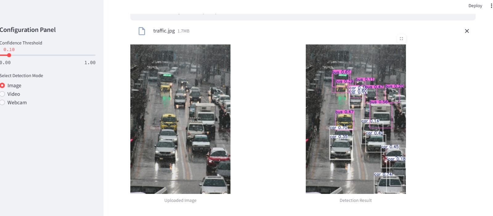
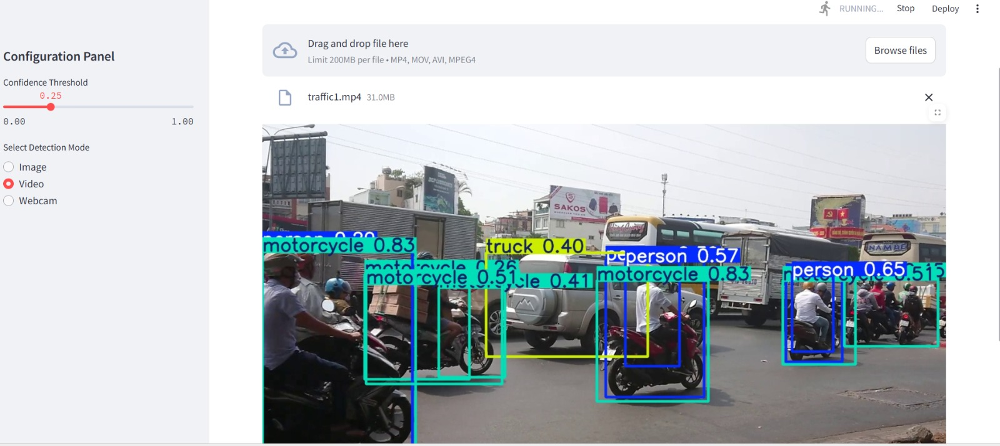

# YOLO Object Detection App

The object recognition project aims to develop a system capable of identifying objects in real-time using machine learning algorithms. This system will enable the identification of various objects captured by a laptop's camera.




## Table of Contents

- [Overview](#overview)
- [Features](#features)
- [Installation](#installation)
  - [Setup Virtual Environment (Optional)](#setup-virtual-environment-optional)
  - [Install Dependencies](#install-dependencies)
- [Usage](#usage)
  - [Running the App](#running-the-app)
  - [App Modes](#app-modes)
- [Configuration](#configuration)
- [Project Structure](#project-structure)
- [Google Colab Notebook](#google-colab-notebook)
- [Future Enhancements](#future-enhancements)
- [Contributing](#contributing)
- [License](#license)

## Overview

The YOLO Object Detection App integrates the YOLO model with Streamlit to offer a seamless and interactive web interface for object detection tasks. Users can upload images or videos, or use a live webcam feed to view real-time detection results with both the original input and the annotated output displayed side by side.

Additionally, this repository includes a Google Colab notebook that walks you through the entire training pipeline—from performing exploratory data analysis (EDA) on the COCO2017 dataset to preprocessing, augmenting images, preparing the training dataset, and finally training the YOLO model.

## Features

- **Real-Time Object Detection:** Fast and accurate object detection using the YOLO model.
- **Multiple Input Modes:** Supports image uploads, video processing, and live webcam feeds.
- **Side-by-Side Display:** Compare the original input and detection results simultaneously.
- **Adjustable Confidence Threshold:** Fine-tune detection sensitivity via a sidebar slider.
- **Training Pipeline Notebook:** A comprehensive Google Colab notebook covering EDA, preprocessing, augmentation, dataset preparation, and training on the COCO2017 dataset.

## Installation

### Setup Virtual Environment (Optional)

It is recommended to use a virtual environment to manage dependencies:

```bash
# Create a virtual environment
python -m venv venv

# Activate the virtual environment
# On Windows:
venv\Scripts\activate
# On macOS/Linux:
source venv/bin/activate
```

### Install Dependencies

Install the required Python packages:

```bash
pip install -r requirements.txt
```

Ensure you have the necessary libraries installed, such as Streamlit, OpenCV, NumPy, and ultralytics.

## Usage

### Running the App

To start the YOLO Object Detection App, run the following command:

```bash
streamlit run app.py
```

This command launches the Streamlit app and provides a local URL (typically [http://localhost:8501](http://localhost:8501)) to access the application in your web browser.

### App Modes

The application supports three detection modes:

#### Image Detection
- **Upload:** Accepts image files (jpg, jpeg, png).
- **Display:** Shows both the original image and the detection result side by side.

#### Video Detection
- **Upload:** Accepts video files (mp4, mov, avi).
- **Processing:** Processes the video frame by frame and displays detection results in real time.

#### Webcam Detection
- **Live Feed:** Uses your device's webcam for real-time object detection.
- **Control:** Provides start/stop buttons to control the webcam stream.

## Configuration

- **Confidence Threshold:** Adjust the slider in the sidebar to set the minimum confidence level for object detection.
- **Model Path:** Update the YOLO model path in the code if your trained model file is stored in a different location.
- **Input Modes:** Select the desired detection mode (Image, Video, or Webcam) from the sidebar.

## Project Structure

```
YOLO-Object-Detection-App/
├── app.py                        # Main application file containing the Streamlit app
├── requirements.txt              # List of Python dependencies
├── Object_Detection_Model.ipynb  # Google Colab notebook for training the model
└── README.md                     # This file
```

## Google Colab Notebook

The repository includes a Google Colab notebook (`Object_Detection_Model.ipynb`) that covers the complete training pipeline:

- **Task 1: Performing EDA for the COCO2017 Dataset**  
  Explore and visualize the dataset to understand its structure and distribution.

- **Task 2: Preprocessing the Images**  
  Apply necessary preprocessing steps to prepare the images for model training.

- **Task 3: Augmentation of the Images**  
  Implement data augmentation techniques to enhance the training dataset.

- **Task 4: Preparing the YOLO Training Dataset**  
  Organize and convert the dataset into a format suitable for YOLO training.

- **Task 5: Training the Model**  
  Train the YOLO object detection model using the preprocessed and augmented dataset.

## Future Enhancements

- Add support for additional detection models.
- Improve the user interface with more customization options.
- Integrate performance metrics and analytics for detection results.
- Expand the training notebook to include hyperparameter tuning and model evaluation.

## Contributing

Contributions are welcome! Please fork this repository and create a pull request with your changes. For major changes, open an issue first to discuss what you would like to modify.

## License

This project is licensed under the MIT License. See the [LICENSE](LICENSE) file for details.
